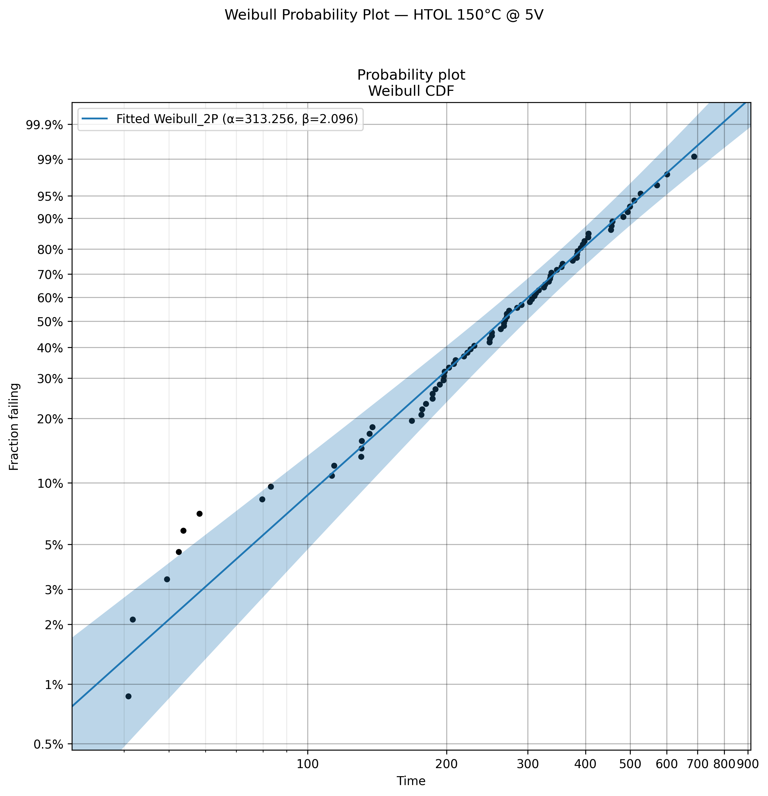

## 📊 Project Overview
In this project I tried to demonstrate **semiconductor-style reliability data analysis** using a synthetic accelerated life test dataset.  
The workflow includes:
- Generating realistic reliability data with multiple stress conditions (HTOL, THB, TC) and censoring.
- **Kaplan–Meier survival analysis** with right-censoring.
- **Weibull-2P modeling** per stress condition.
- **Arrhenius temperature acceleration analysis** for HTOL.
- Showcasing-quality visualizations and CSV outputs.

---

## 🔍 Kaplan–Meier Survival by Stress Group
**Purpose:** To visualize survival probability over time and compare stress conditions.  
**Comments:** Higher temperature HTOL tests fail faster; low-stress TC and THB conditions show minimal degradation.


---

## 📈 Weibull Parameters vs Temperature
**Purpose:** To show how **shape (β)** and **scale (η)** parameters vary with stress level.  
**Comments:** β > 1 for all groups → wear-out dominated failures; η decreases with increasing temperature/voltage for HTOL.


---

## 📊 Weibull Probability Plot (Example: HTOL 150 °C @ 5 V)
**Purpose:** To assess fit quality for a specific stress condition.  
**Comments:** Fitted Weibull CDF aligns closely with empirical failure data; CI region is narrow, indicating high confidence.



---

## 🌡 Arrhenius Temperature Acceleration (HTOL)
**Purpose:** In order to quantify acceleration of failures with temperature.  
**Comments:** Positive slope in ln(η) vs 1/T indicates shorter lifetimes at higher temperatures; slope magnitude corresponds to a realistic activation energy for electronic degradation.


---

## 📂 Key Outputs
| File | Description |
|------|-------------|
| `data/reliability_synthetic.csv` | Synthetic dataset with Test_Type, Temp, Voltage, Failures, and Censoring |
| `results/km_medians_by_group.csv` | Median survival times by stress group |
| `results/weibull_group_fits.csv` | Weibull fit parameters per group |
| `results/arrhenius_fit_coeffs_HTOL.csv` | Arrhenius regression coefficients for HTOL |
| `notebooks/reliability_analysis.ipynb` | Full analysis workflow |

---

### 🛠️ How to Run
```bash
# run Python script
python scripts/make_synthetic_reliability.py

# better to have venv & install deps
python3 -m venv venv
source venv/bin/activate  # for Windows: venv\Scripts\activate
pip install -r requirements.txt

# launch Notebook
jupyter notebook notebooks/reliability_analysis.ipynb
