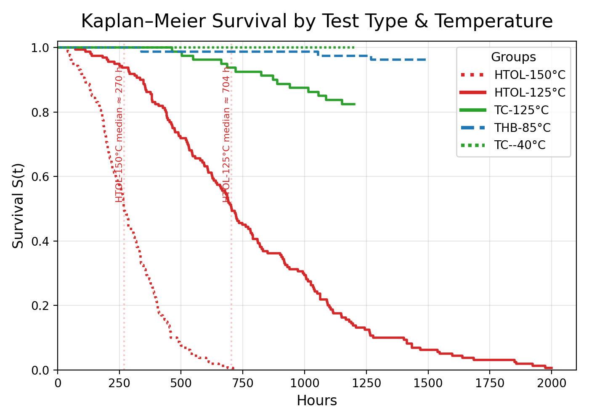
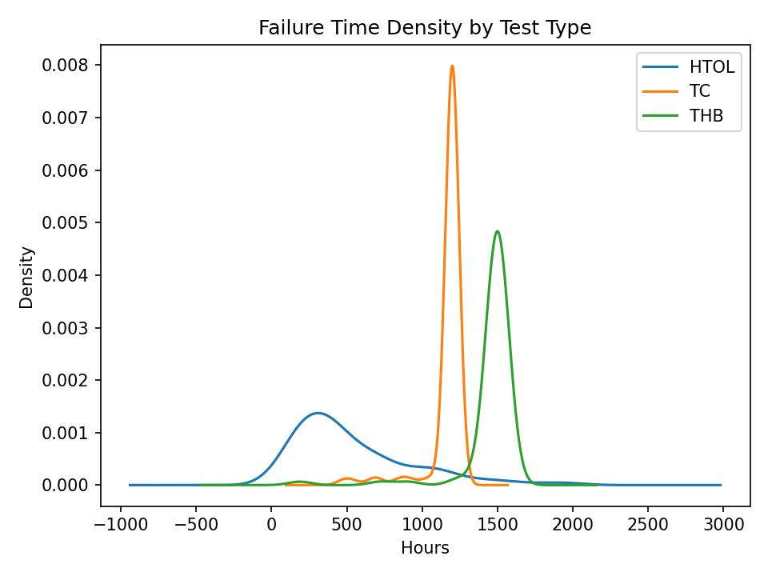
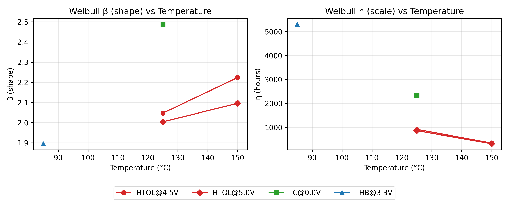
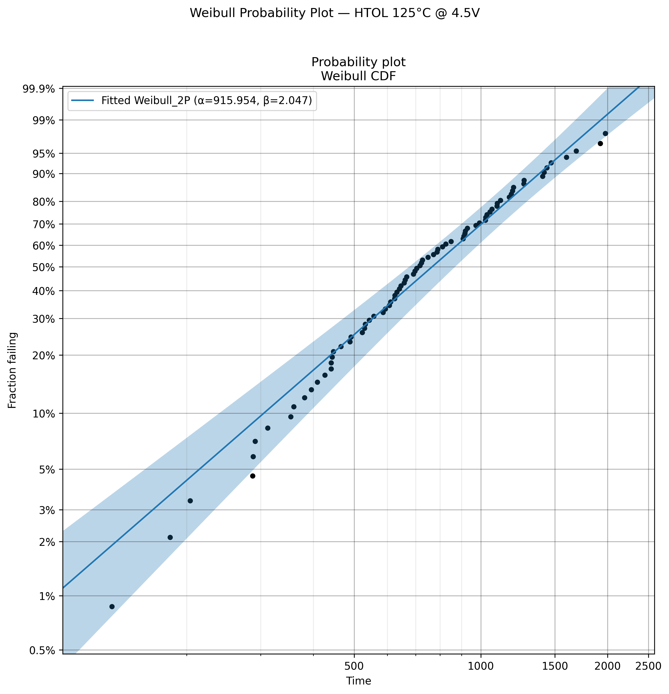
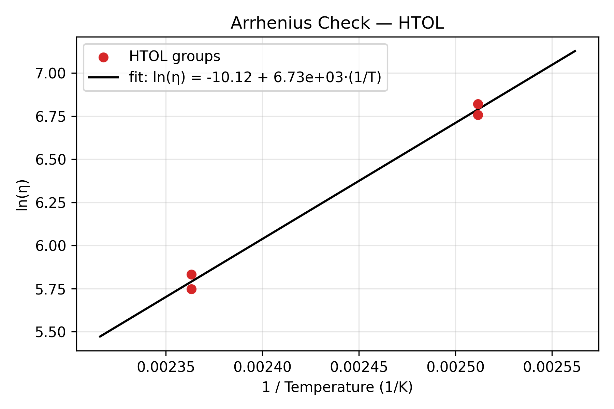

# Semiconductor Reliability Lifetime Analysis

Modern Semiconductors must operate reliably for years powering everything from cars to smartphones, but testing engineers can’t wait years to validate reliability. Instead, they run **accelerated stress tests** such as:  

- **HTOL** (High-Temperature Operating Life)  
- **THB** (Temperature Humidity Bias)  
- **TC** (Temperature Cycling)  

These tests simulate years of aging in weeks or months. The challenge is to extract **meaningful reliability insights** from limited, noisy, and often censored lifetime data.  

This project demonstrates such an analysis pipeline using **synthetic accelerated life test data**, combining survival statistics, Weibull reliability modeling, and Arrhenius temperature acceleration.  

---

## Workflow Glance 

- Generate realistic **synthetic semiconductor reliability data** with multiple stress conditions (HTOL, THB, TC) and censoring. 
- Apply **Kaplan–Meier survival analysis** (with censoring).  
- Perform **Weibull-2P modeling** per stress condition.  
- Use **Arrhenius acceleration modeling** to relate temperature and lifetime for HTOL.  
- Showcasing-quality visualizations **publication-style plots** and reproducible CSV summaries. 

---

## Dataset Overview  

**File:** `data/reliability_synthetic.csv`  
560 synthetic devices tested under multiple stress conditions.  

| Column | Description |
|--------|-------------|
| `Device_ID` | Unique identifier for each device |
| `Test_Type` | HTOL, THB, or TC |
| `Stress_Temperature_C` | Applied stress temperature (°C) |
| `Stress_Voltage_V` | Operating voltage under stress |
| `Failure_Time_Hours` | Time-to-failure or censoring point (hours) |
| `Censored` | 0 = failure observed, 1 = still alive at test end |
| `Batch_ID` | Manufacturing lot ID (captures lot-to-lot variation) |

**Note:** Censoring is common in real semiconductor tests, not all parts fail within the test window. For further analysis, we could think of more features such as, Measurement_No, Parameter_Value, Test_Date and so on.   

---

## Derived Results 

**Median Survival Times**

File: `results/km_medians_by_group.csv` 
- Median device lifetimes per stress group (Test_Type × Temperature).
- Derived from Kaplan–Meier survival curves.
- Useful for quick comparison across conditions.

**Weibull Fit Parameters**

File: `results/weibull_group_fits.csv` 
- Fitted Weibull-2P parameters for each group.
- β (shape): indicates failure mode (β>1 -> wear-out).
- η (scale): characteristic life (hours).
- Includes MTTF (mean time to failure) and hazard interpretation.

**Arrhenius Regression Coefficients (HTOL only)**

File: `results/arrhenius_fit_coeffs_HTOL.csv` 
- Linear regression of ln(η) vs 1/T.
- Provides activation energy for temperature-driven aging.
- Used to extrapolate field lifetimes from high-temperature stress tests.

---

## Key Analysis  

### Kaplan–Meier Survival by Stress Group  
- HTOL @ 150 °C fails fastest (median ≈ 270 h).
- HTOL @ 125 °C lasts longer (median ≈ 704 h).
- THB (85 °C) and TC (-40 °C, 125 °C) show minimal degradation within test duration.  

  

HTOL at higher temperature accelerates **electromigration** and **oxide breakdown**, while humidity bias (THB) and thermal cycling (TC) induce failures much more slowly, so survival remains high in this test window.  

---

### Failure Time Density by Test Type  
- HTOL shows a broad failure distribution due to combined **temperature + voltage** acceleration.  
- TC and THB distributions are much narrower, with failures concentrated around stress thresholds.  

  

The wider HTOL spread reflects device-to-device variability in degradation rates (e.g., electromigration onset). By contrast, TC and THB failures occur more uniformly, triggered by **package cracking** or **moisture ingress** once specific stress limits are reached.  

---

### Weibull Parameters vs Temperature  
- **β > 1** : wear-out dominated failures.  
- **η decreases with temperature** (HTOL), confirming stress acceleration.  
- TC/THB have higher η (longer lifetimes).  

 

The upward trend in β at higher HTOL stress means devices fail more progressively once wear-out mechanisms (like electromigration or oxide breakdown) start. The drop in η at 150 °C clearly reflects **temperature-activated aging**, may reducing lifetime. HTOL shows decreasing η with temperature, confirms acceleration. TC has higher η, consistent with its slower degradation.

---

### Weibull Probability Plots (Fit Quality Checks)  
- **HTOL @ 125 °C, 4.5 V: η ≈ 916 h and β ≈ 2.05**, here devices show wear-out failures at a moderate pace.
- **HTOL @ 150 °C, 5.0 V: η ≈ 313 h and β ≈ 2.10**, visibly much shorter lifetimes due to higher stress, but similar failure mode.
- When stress ↑ -> η ↓, β stable -> same failure mode.
- In both plots, points align closely with the fitted Weibull CDF, and confidence intervals are narrow, confirming stable parameter estimates. 

  
  

Its evident that **increasing temperature accelerates degradation (lower η)**, while the **failure mechanism remains the same (β ~ 2)**. No evidence of early-life (“infant mortality”) failures is seen, may consistent with controlled semiconductor reliability testing using this sample dataset.  

---

### Arrhenius Temperature Acceleration (HTOL)  
- Positive slope in ln(η) vs 1/T, shorter lifetimes at higher T supports Arrhenius acceleration.  
- Extracted slope corresponds to realistic **activation energy (~0.6–0.8 eV)**, typical for diffusion-driven mechanisms like electromigration or oxide wear-out.



This means our **synthetic data** reproduces the kind of temperature dependence expected in real semiconductor qualification. Such fits are used to extrapolate device lifetimes from accelerated stress (125–150 °C) down to normal operating conditions (e.g., 55–85 °C). 

---

## Key Outputs
| File | Description |
|------|-------------|
| `data/reliability_synthetic.csv` | Synthetic dataset with Test_Type, Temp, Voltage, Failures, and Censoring |
| `results/km_medians_by_group.csv` | Median survival times by stress group |
| `results/weibull_group_fits.csv` | Weibull fit parameters per group |
| `results/arrhenius_fit_coeffs_HTOL.csv` | Arrhenius regression coefficients for HTOL |
| `notebooks/reliability_analysis.ipynb` | Full analysis workflow |

---

## Repo Structure 

```text
reliability_demo/    # Python package (data, Weibull fits, plotting, CLI)  
notebooks/           # Clean showcase notebook  
data/                # Synthetic dataset  
results/             # Output plots + CSV summaries  
requirements.txt     # Dependencies  
README.md            # Project overview  
``` 
---

### How to Run
```bash
# better to have venv & install deps
python3 -m venv venv
source venv/bin/activate  # for Windows: venv\Scripts\activate

# install dependencies
pip install -r requirements.txt

# run pipeline
python -m reliability_demo.cli --seed 2025

# explore notebook
jupyter notebook notebooks/reliability_pipeline.ipynb
```
---

## Limitations  
- Here Dataset is **synthetic**; real semiconductor data would show mixed failure modes and noisier censoring.  
- Only **temperature acceleration (Arrhenius)** was modeled; real devices require multi-stress models (Eyring).  
- Did not include **degradation parameters** (e.g., leakage, ΔVth).  

## Future Work  
- Extend to **multi-stress acceleration models** (temperature + voltage + humidity).  
- Incorporate **degradation measurements** alongside failure times.  
- Apply **Bayesian or hierarchical models** for lot-to-lot variation.  
- Project **field lifetime estimates** under normal operating conditions.
- Apply **Machine Learning models** training and predict.